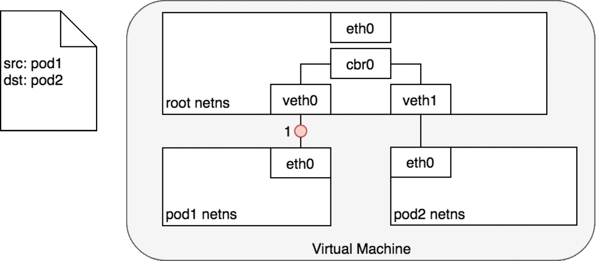
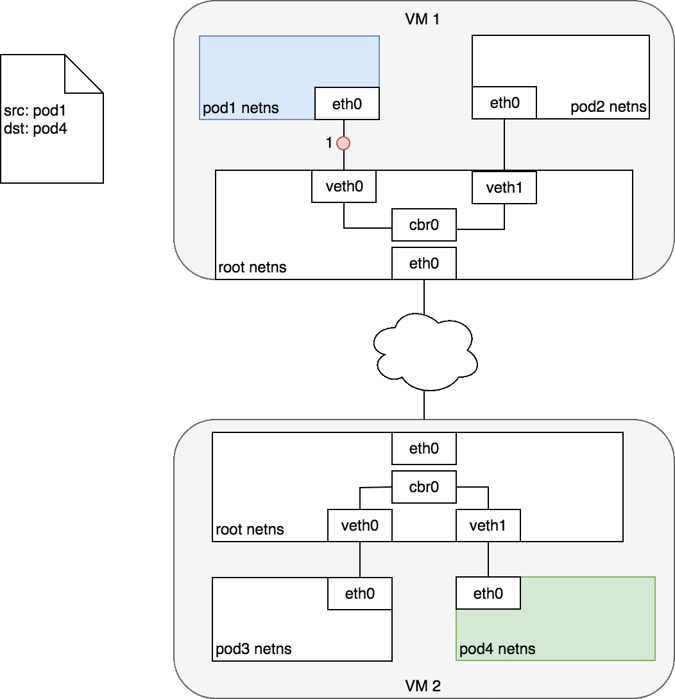
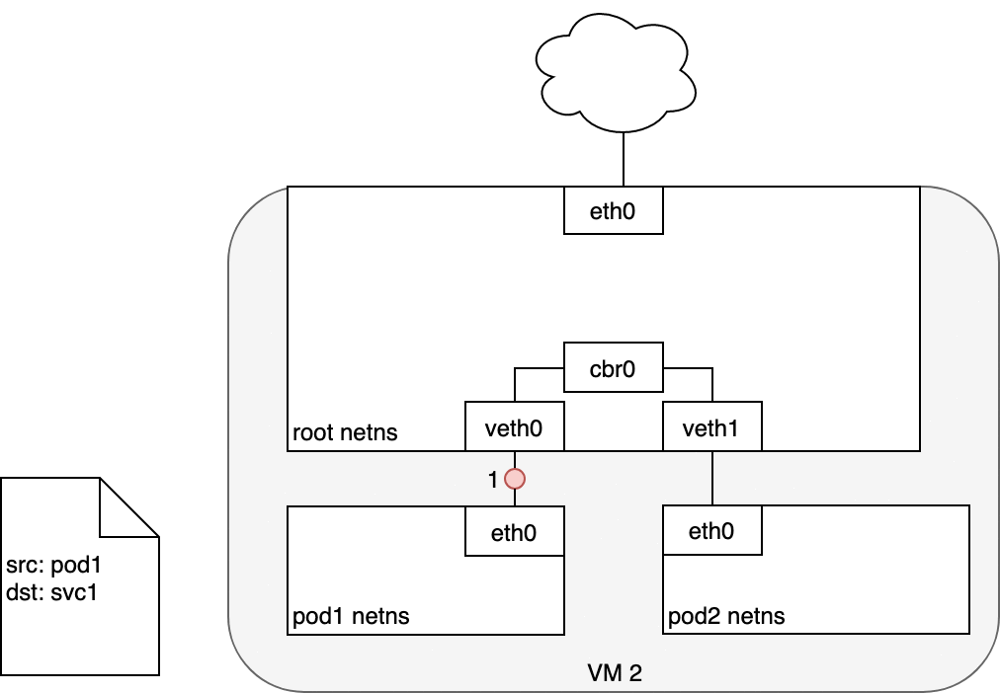

### CLUSTER NETWORKING

1. Pod Abstraction over Container

 - Many Pods can run on same ports so this is where many replicas of the same application running on the server and there is no issue with port mapping here. Consider Pod as your own laptop with dedicated IP address.

 Kubernetes dictates the following requirements on any networking implementation:

- all Pods can communicate with all other Pods without using network address translation (NAT).
- all Nodes can communicate with all Pods without NAT.
- the IP that a Pod sees itself as is the same IP that others see it as.

Given these constraints, we are left with four distinct networking problems to solve.

 ## Types of Network Communication for Clusters

 - Container-to-Container
  * This is using localhost and portNumber.
  * Containers within the pods will all have same IP address and port space assigned through the network namespace assigned to the Pod, and can find each other via localhost since they reside in the same namespace.

 - Pod-to-Pod Networking Same Node
  

 - Pod 1 to Pod 2 Network Flow: 
  Pod 1 sends a packet to its own Ethernet device eth0 which is available as the default device for the Pod. For Pod 1, eth0 is connected via a virtual Ethernet device to the root namespace, veth0 (1). The bridge cbr0 is configured with veth0 a network segment attached to it. Once the packet reaches the bridge, the bridge resolves the correct network segment to send the packet to — veth1 using the ARP protocol (3). When the packet reaches the virtual device veth1, it is forwarded directly to Pod 2’s namespace and the eth0 device within that namespace (4). Throughout this traffic flow, each Pod is communicating only with eth0 on localhost and the traffic is routed to the correct Pod. The development experience for using the network is the default behaviour that a developer would expect.

- Pod to Pod on different Nodes:

- The destination Pod (highlighted in green) is on a different Node from the source Pod (higlighted in blue). The packet begins by being sent through Pod 1’s Ethernet device which is paired with the virtual Ethernet device in the root namespace (1). Ultimately, the packet ends up at the root namespace’s network bridge (2). ARP will fail at the bridge because there is no device connected to the bridge with the correct MAC address for the packet. On failure, the bridge sends the packet out the default route — the root namespace’s eth0 device. At this point the route leaves the Node and enters the network (3). We assume for now that the network can route the packet to the correct Node based on the CIDR block assigned to the Node (4). The packet enters the root namespace of the destination Node (eth0 on VM 2), where it is routed through the bridge to the correct virtual Ethernet device (5). Finally, the route completes by flowing through the virtual Ethernet device’s pair residing within Pod 4’s namespace (6). Generally speaking, each Node knows how to deliver packets to Pods that are running within it. Once a packet reaches a destination Node, packets flow the same way they do for routing traffic between Pods on the same Node.

- With AWS, Amazon maintains a container networking plugin for Kubernetes that allows Node to Node networking to operate within an Amazon VPC environment using a Container Networking Interface (CNI) plugin.
The Container Networking Interface (CNI) provides a common API for connecting containers to the outside network.

-  Pod-to-Service Networking

A service creates a virtualized IP and then used iptables which is installed on the Node to Network Address Translation and Load Balancing to other Pods.
- Uses iptables.
- When routing a packet between a Pod and Service, the journey begins in the same way as before. The packet first leaves the Pod through the eth0 interface attached to the Pod’s network namespace (1). Then it travels through the virtual Ethernet device to the bridge (2). The ARP protocol running on the bridge does not know about the Service and so it transfers the packet out through the default route — eth0 (3). Here, something different happens. Before being accepted at eth0, the packet is filtered through iptables. After receiving the packet, iptables uses the rules installed on the Node by kube-proxy in response to Service or Pod events to rewrite the destination of the packet from the Service IP to a specific Pod IP (4). The packet is now destined to reach Pod 4 rather than the Service’s virtual IP. 

 