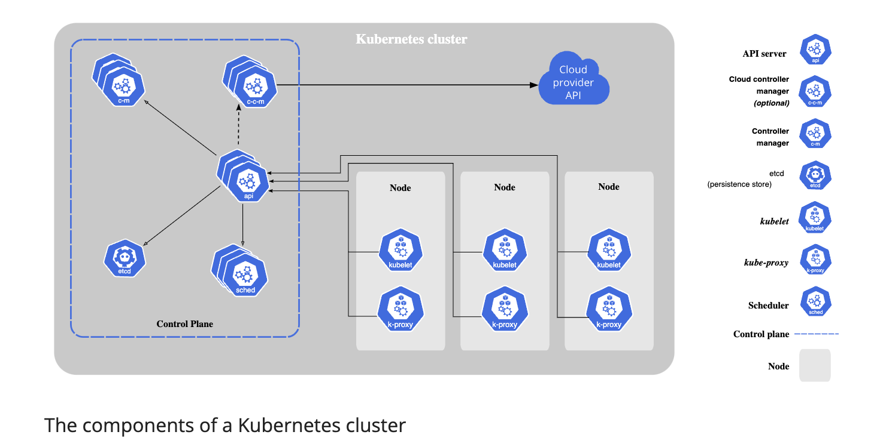

# Kubernetes Architecture & Components

## 1. Architecture Overview


   K8s has a client-server architecture. 

### High-Level Architecture
- Control Plane (Master) and Worker Nodes
- Distributed system for container orchestration
- API-driven architecture

### Core Concepts
- Declarative configuration
- Desired state management
- Self-healing system

## 2. Control Plane Components

{"type":"excalidraw/clipboard","elements":[{"id":"v4i9BcCsT0sqiEjsZkgQU","type":"rectangle","x":232.51301103944095,"y":3242.930325867003,"width":404.7905922416103,"height":648.9573783178755,"angle":0,"strokeColor":"#1971c2","backgroundColor":"#b2f2bb","fillStyle":"solid","strokeWidth":2,"strokeStyle":"solid","roughness":0,"opacity":100,"groupIds":[],"frameId":null,"index":"b0q","roundness":{"type":3},"seed":1512767967,"version":356,"versionNonce":2005787281,"isDeleted":false,"boundElements":[],"updated":1740257105747,"link":null,"locked":false}],"files":{}}

  The control plane's components make global decisions about the cluster (for example, scheduling), as well as detecting and responding to cluster events. Control plane components can be run on any machine in the cluster.

### API Server (kube-apiserver)
- Front end for the Kubernetes control plane or backbone of communication
- Scales by deploying more instances
- Allows to interact with the components using KubeCTL or by sending HTTP requests


### etcd
- Distributed key-value store
- Stores cluster state(like when Pod dies) which is used for the communication b/w master and worker nodes
- Consistent and highly-available
- The other components will work based on the information that etcd stores.

### Scheduler (kube-scheduler)
- Watches for new Pods
- Assigns Pods to Nodes
- Considers:
  - Resource requirements
  - Hardware/software constraints
  Note: This just decides on which nodes a new Pod will be scheduled. The process that actually starts the Pod is Kubelet.
  Scheduler make requests to Kubelet of the corresponding Nodes to start the Pods.

### Controller Manager
- Detect state changes(if pod crashes, restart it)
- It request the Scheduler to reschedule those dead Pods
- This is dependent on the etcd since etcd stores state of the cluster
- Runs controller processes
- Types:
  - Node Controller: Node health monitoring ( Responsible for noticing and responding when nodes go down.)
  - Job Controller: Pod maintenance
  - Endpoints Controller: Service endpoints
  - Service Account

## 3. Worker Node Components

{"type":"excalidraw/clipboard","elements":[{"id":"G4wuYOT7GfX2GbDBgCHQE","type":"rectangle","x":262.83971917259845,"y":2285.167837346164,"width":404.7905922416103,"height":648.9573783178755,"angle":0,"strokeColor":"#f08c00","backgroundColor":"#b2f2bb","fillStyle":"solid","strokeWidth":2,"strokeStyle":"solid","roughness":0,"opacity":100,"groupIds":[],"frameId":null,"index":"b02","roundness":{"type":3},"seed":949103615,"version":251,"versionNonce":1131854193,"isDeleted":false,"boundElements":[],"updated":1740255424694,"link":null,"locked":false}],"files":{}}

 Does the work running your app in pods and containers.
 3 processes must be installed on every node 
### kubelet
- An agent that runs on each node in the cluster.
- Helps in communication
- Ensures containers running in Pod
- Reports node and Pod status
- Handles container operations

### kube-proxy
- Network proxy on each node
- Implements Service concept
- Handles IP tables rules
- Manages pod networking
- Prevents Network Overhead
   * If an application say my-app is making a request database instead of service forwarding the request to any replica it will 
forward it to the replica that is running on the same node as the Pod that initiated the request.

### Container Runtime
- Responsible for running containers
- Examples:
  - containerd
  - CRI-O
  - Docker Engine

K8s Cluster is made of multiple nodes. Each will have Kubelet, Container Runtime and KubeProxy installed. 
Communication b/w the nodes happens through Services.

## 4. Key Terms and Concepts
### Cluster
- Logical grouping of all the components
- Set of worker nodes
- Control plane management
- Workload distribution

### KubeCTL
- A command line interface(CLI) for communicating with K8s cluster's control plane using K8s API.
- Tool is named as - kubectl 
- Syntax: kubectl [COMMAND][TYPE][NAME][FLAG](Important for Exam)
- Deep Dive: [Kubernetes kubectl Reference](https://kubernetes.io/docs/reference/kubectl/)

### Node
- Physical or virtual machine
- Runs containerized applications
- Managed by control plane

### Pod
- Smallest deployable unit
- One or more containers
- Allocated its own internal IP address
- Shared storage/network
- Co-located and co-scheduled

### Service
- Stable endpoint for Pod communication
- Persist an address even when the Pod dies.
- Application Pod should run on a browser so we need external service and for database Pod its internal service while creating Service
- Acts as a load balancer to distribute the requests equally

### Ingress
- Maps external HTTP/HTTPS traffic to internal services using protocol-aware rules based on URIs, hostnames, and paths

### Namespace 
- Provides mechanism for isolating different workloads on the same cluster

### ConfigMaps
- API object that stores non-confidential data
- Decouples environment-specific configuration from container images to make applications portable.
- Example: Stores Feature flags, API endpoints, Database URLs.
- Say DB endpoint URL changes from mongo_db_services to mongo_db so in that case,
we can avoid rebuilding the image by placing this URL in ConfigMap which is connected to Pod


### Secret
- Contains a small amount of sensitive data such as a password, a token, or a key.
- The database pwd and user can be changed so having it in Base64 inside Secret is secured
- This is connected to Pod similar to ConfigMap

### Deployments
- Blueprint for pods
- Primary way to deploy applications in Kubernetes
- Declarative updates for Pods
- We as a developer will need to work on creating them 

### ReplicaSet
- Maintains stable set of replica Pods
- Guarantees availability
- Part of Deployment's implementation

### StatefulSet
- Manages stateful applications which includes Database
- If database pod dies we cant have replicas of this in Deployments instead StatefulSet since they might end up pointing to same storage which leads to inconsistencies in read or write
- Creating Stateful is not easy since we deal with states to make sure there are no inconsistencies 
- So having such Stateful application outside K8s cluster is better way
- Provides persistent storage
- Ordered deployment and scaling

### Volume
- Managed through a storage which is external hard drive plugged into K8s Cluster.
- Data sharing between containers
- Persistent data storage: If database Pod get restarted the data will be gone, using this we can persist the data


## 5. Communication Flow
### Control Plane Communication
1. All components → API Server
2. API Server → etcd
3. Controllers/Scheduler → API Server

### Node Communication
1. kubelet → API Server
2. kube-proxy → API Server
3. Applications → Service discovery

## 6. Practice Examples
### Check Component Status
```bash
# View cluster components
kubectl get componentstatuses

# Check node status
kubectl get nodes

# View system pods
kubectl get pods -n kube-system