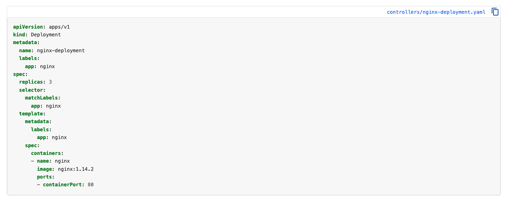
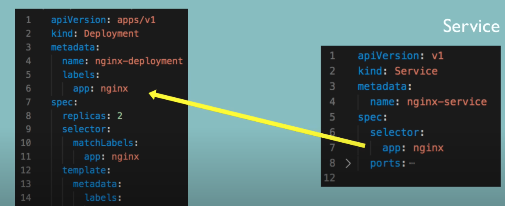

Deployment

- Provides declarative updates for Pods and ReplicaSets

Creating a Deployment

- The format is yaml, so be careful about the indentation
- Consists of metadata and specification
- Specification - attributes of spec are specific to the kind
- A Deployment named nginx-deployment is created, indicated by the .metadata.name field
- The Deployment creates a ReplicaSet that creates three replicated Pods, indicated by the .spec.replicas field.
Not recommended to create ReplicaSets directly instead, a deployment can create and manage.
- The .spec.selector field defines how the created ReplicaSet finds which Pods to manage.
- The .spec.template field contains the following sub-fields which applies to a Pod:
        * The Pods are labeled app: nginx using the .metadata.labels field.
        * The Pod template's specification, or .spec field, indicates that the Pods run one container, nginx, which runs the nginx Docker Hub image at version 1.14.2.
        * Create one container and name it nginx using the .spec.containers[0].name field.

Labels and Selectors
 - metadata has labels and specification has selectors
 - Deployment will connect .spec.selector.matchLabels.app and .spec.template.metadata.labels.app to match the .metadata.labels.app. to create the connection so deployment will know which Pod belongs to it.

 
 Connecting Services to Deployments

 

So the Service will have .spec.selector.app which makes the connection to Deployment and its Pods using .metadata.labels.app and 
.template.metadata.labels.app which will have the name like here nginx. Since Service will know which Deployments and its Pods are connected. 

