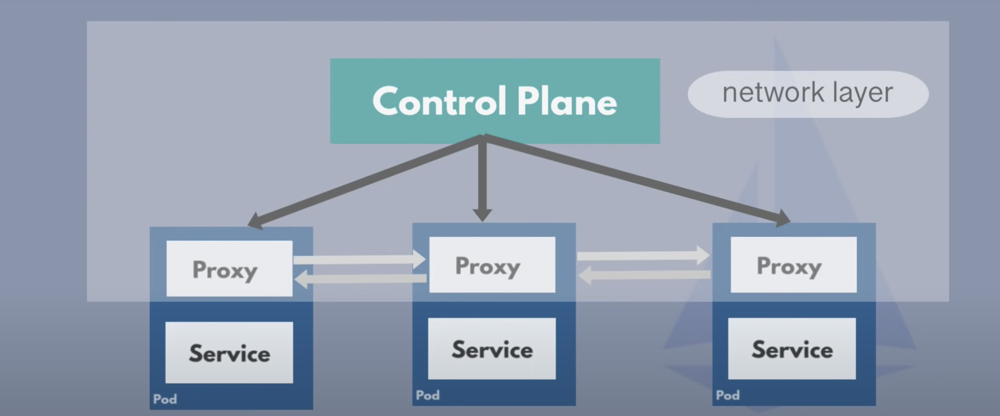

### Service Mesh

- A network layer for service to service communication consisting of Control plane and Proxies is known as Service Mesh.
- Service means "an application" not a K8s Service component.

## Features of Service Mesh

1. Traffic Splitting
 
  Say for example for Payment Service, a new version 3.0 is built, tested and deployed in production environment.
  What if there are bugs which was not captured during tests, in that case new version which isn't working is not needed which may cost a lot of money. In this case, we can send 1% or 10% traffic to the new version and remaining 90% to the stable version for some period of time. Using a service mesh, we can configure a web server to direct 90% traffic to version 2.0 and remaining to version 3.0. This is also known as Canary Deployment.

## Istio

- Service Mesh is a pattern and Istio is one of its implementation.
- Istio can be configured using K8s YAML files.